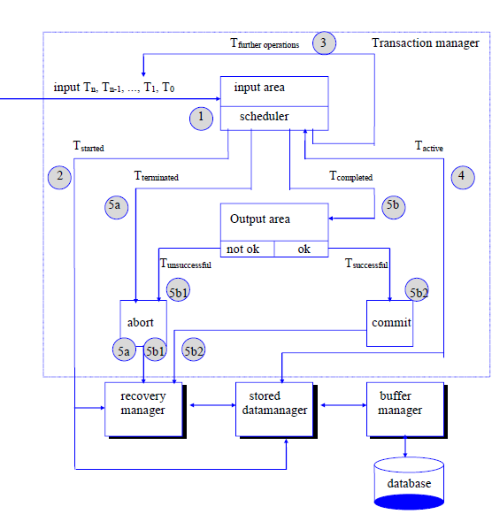

# Relational Databases & Datawarehousing
| Inhoudstafel  |
| :---  |
| 1.[SQL Review](#1sql-review)
| 2.[SQL Advanced](#2sql-advanced)|
| 3.[Window Functions](#3windows-functions)|
| 4.[DB Programming](#)|
| 5.[Indexen](#5indexes-and-performance)|
| 6.[Basics of Transaction Management](#6basics-of-transaction-management)|
| 7.[DWH + BI](#7-datawarehousing--business-intelligence-bi)|
| 8.[NoSQL](#8-nosql-introduction)|

# 1.SQL Review
## SQL sub languages
### Data Definition Language (DDL)

- CREATE, ALTER, DROP

### Data Manipulation Language (DML)

- SELECT, INSERT, UPDATE, DELETE

### Data Control Language (DCL)

- GRANT, REVOKE, DENY

## Consulting data
### 1 table

- SELECT
- FROM
- WHERE
- GROUP BY
- HAVING
- ORDER BY
- AS

### >1 table

- JOIN
    - inner join
    - outer join
    - cross join


- UNION ⇒ combineert het resultaat van 2 of meer queries
- INTERSECT
- EXCEPT

# 2.SQL Advanced

- Subquery's
    - Simple nested query's
    - Correlated subquery's
    - Operator EXISTS
- Set Operators
- Common Table Expressions

## Subqueries
- basic form
    ``` sql
    SELECT
    FROM
    WHERE condition
    ```
### nested subqueries

- outer level query
    - ⇒ de eerste SELECT, de main question
- inner level query
    - ⇒ de SELECT in de WHERE clause (of HAVING clause)
        - altijd eerst uitgevoerd
        - altijd tussen ( )
        - kan in meer levels bevatten
- subqueries that returns a single value
    - met alle relational operators: =, >, <, ≤, ≥, <>
- subqueries that returns a single column
    - operators IN, NOT IN, ANY, ALL
- ANY and ALL keywords
    - gebruikt in combinatie met de relational operators en subqueries dat een kolom van waarde weergeeft
    - ALL geeft TRUE wanneer alle waarden die in subquery voldoen aan de conditie
    - ANY geeft TRUE weer wanneer er minstens 1 voldoet aan de conditie

### Correlated subqueries
- de inner query gebruikt informatie uit de outer query
- de subquery bevat een zoek conditie dat verwijst naar de main query, wat de subquery doet afhangen van de main query
- de order van uitvoeren is van boven naar beneden
  - niet van beneden naar boven zoalls een simpele subquery
- stappenplan
    
    

- voorbeeld
    ```sql
    SELECT FirstName + ' ' + LastName As Fullname, Salary
    FROM Employees
    WHERE Salary > (SELECT AVG(Salary) FROM Employees)
    ```
- de EXISTS operator
  - test het bestaan van de result set
  - voorbeeld
        ```sql
        SELECT *
        FROM Customers AS c
        WHERE EXISTS
        (SELECT * FROM Orders WHERE CustomerID = c.customerID)
- NOT EXISTS
    ```sql
    SELECT *
    FROM Customers AS c
    WHERE NOT EXISTS
    (SELECT * FROM Orders WHERE CustomerID = customerID)

### 3 manieren om hetzelfde resultaat te verkrijgen
- OUTER JOIN
    ```sql
    SELECT *
    FROM Customers c LEFT JOIN Orders o ON c.CustomerID = o.CustomerID
    WHERE o.CustomerID is NULL
    ```
- simple subquery
    ```sql
    SELECT *
    FROM Customers
    WHERE CustomerID NOT IN (SELECT DISTINCT CustomerID FROM Orders)
    ```
- Correlated subquery
    ```sql
    SELECT *
    FROM Customers AS c
    WHERE NOT EXISTS
    (SELECT * FROM Orders WHERE CustomerID = c.customerID)
    ```
### subqueries in the FROM-clause
- doordat het resultaat van een query een tabel is, kan deze ook gebruikt worden in een FROM-clause
- dit wordt een derived table genoemd
- in MS-SQL Server de tabel in een subquery moet een naam hebben
### subqueries in the SELECT-clause

## DML
### Tip for not destroying your database

```sql
BEGIN TRANSACTION -- starts a new "transaction" --> Saves previous state of DB in buffer

-- several "destructive" commands can go here:
INSERT INTO Products(ProductName) 
values ('TestProduct');

-- only you (in  your session) can see changes
SELECT * FROM Products WHERE ProductID = (SELECT MAX(ProductID) FROM Products)

ROLLBACK;   --> ends transaction and restores database in previous state

-- COMMIT;  --> ends transaction and makes changes permanen
```

### INSERT: add new records

- 1 rij
    - alleen de not NULL waarden for de specifieke kolomen
    - alle kolom waarden meegeven
- 

### UPDATE: modify values

- alle rijen in een tabel
    
    ```sql
    UPDATE Products
    SET UnitPrice = UnitPrice * 1.1
    ```
    
- 1 rij aanpassen of een groep van rijen
    
    ```sql
    UPDATE Products
    SET UnitPrice = UnitPrice * 1.1, UnitsInStock = 0
    WHERE ProductName LIKE '%Bröd%'
    ```
    
- rijen aanpassen obv data in andere tabel
    - via subqueries (niet via JOIN)
    
    ```sql
    UPDATE Products
    SET UnitPrice = (UnitPrice * 1.1)
    WHERE SupplierID IN
    (SELECT SupplierID FROM Suppliers WHERE country = 'USA')
    ```
    

### DELETE: remove records

- verwijder een paar rijen
    - samen met WHERE clause
    
    ```sql
    DELETE FROM Products
    WHERE ProductName LIKE '%Bröd%'
    ```
    
- alle rijen
    - via DELETE: identiteit waarden blijft verder gaan
    - via TRUNCATE: identiteit start terug van 1, maar heeft geen WHERE clause
- rijen aanpassen obv data in een andere tabel
    - nie via JOIN, alleen maar subqueries
    
    ```sql
    DELETE FROM OrderDetails
    WHERE OrderID IN
     (SELECT OrderID FROM Orders WHERE OrdersDate = (SELECT MAX(OrderDate) FROM Orders))
    ```
    

### MERGE: combine INSERT, UPDATE, DELETE

- combineren van INSERT, UPDATE en DELETE

## Views

### Introductie

- een opgeslagen SELECT statement
- Voordelen
    - het verbergen van de complexiteit van de database
    - gebruik voor het beveiligen van data
    - organiseren van data voor het exporteren van andere applicaties

```sql
CREATE VIEW view_name [(column_list] AS select_statement
[with check option]
```

### CRUD Operations

- Creating a view
    ```sql
    CREATE VIEW V_ProductsCustomer(productcode, company, quantity)
    AS SELECT od.ProductID, c.CompanyName, sum(od.Quantity)
    FROM Customers c
    JOIN Orders o ON o.CustomerID = c.CustomerID
    JOIN OrderDetails od ON o.OrderID = od.OrderID
    GROUP BY od.ProductID, c.CompanyName;
    ```
    
- using a view
    ```sql
    SELECT * FROM V_ProductsCostumer;
    ```
    
- Changing a view
    ```sql
    ALTER VIEW V_ProductsCustomer(productcode, company)
    AS SELECT od.ProductID, c.CompanyName
    FROM Customers c
    JOIN Orders o ON o.CustomerID = c.CustomerID
    JOIN OrderDetails od ON o.OrderID = od.OrderID
    GROUP BY od.ProductID, c.CompanyName;
    ```
    
- Deleting a view
    
    ```sql
    DROP VIEW V_ProductsCustomer
    ```
    

## Common Table Expressions (CTE)
### Definition
- CTE = WITH-componenten gebruiken zodat je de subquery een naam kan geven en het hergebruiken in de rest van de query
### Example
``` sql
WITH numberOfOrdersPerCustomer(customerid, numberOfOrders) AS
(SELECT customerid, COUNT(orderid)
FROM orders
GROUP BY customerid)

SELECT AVG(numberOfOrders * 1.0) AS AveragerNumberOfOrdersPerCustomer
FROM numberOfOrdersPerCustomer
```
### CTE's vs Views
- gelijkheden
  - WITH ~ CREATE VIEW
  - zijn beide virtuele tabellen: de inhoud is afgeleid van andere tabellen
- verschillen
  - een CTE is er enkel tijdens een SELECT-statement
  - CTE is niet zichtbaar voor andere gebruikers en applicatie's
  
### CTE's vs Subqueries
- gelijkheden:
  - beide zijn virtuele tabellen
- verschillen:
  - CTE kan hergebruikt worden in dezelfde query
  - een subquery is gedefinieerd in de clause waar het gebruikt werd (SELECT/FROM/WHERE/...)
  - een CTE is gedefinieerd in het begin van de query
  - een simpele subquery kan altijd vervangen worden door een CTE

### Recursive SELECT's
- 

# 3.Windows Functions
## Business case
- curante sales vergelijken met vorige sales
- geïntroduceerd in SQL: 2003
  
## OVER clause
- de resultaten van een SELECT zijn verdeeld
- de OVER clause creërt partition en ordening
- de partitie gedraagt zich als een windows die over de data shift
- de OVER clause kan gebruikt worden met een standaar aggregate functies (sum, avg,..) of specifieke window functies(rank, lag, ...)

### voorbeeld: running total
```sql
SELECT CategoryID, ProductID, UnitsInStock, 
SUM(UnitInStock) OVER (PARTITION BY CategoryID ORDER BY CategoryID,
ProductID) TotalUnitsInStockPerCategory
FROM Products
ORDER BY CategoryID, ProductID
```
- OVER clause:
  - simpeler, efficiënter
  - de som is uitgerekend voor iedere partities
  
## RANGE
- de echte bedoeling van windows functions: het aanstellen tot een windows dat over een result set shifts
- met RANGE, 3 opties:
  - `RANGE BETWEEN UNBOUNDED PRECEDING AND CURRENT ROW`
  - `RANGE BETWEEN CURRENT ROW AND UNBOUNDED FOLLOWING`
  - `RANGE BETWEEN UNBOUNDED PRECEDING AND UNBOUNDED FOLLOWING`
- PARTITION is optioneel
- ORDER BY is verplicht

## ROWS
- bij het gebruik van RANGE, de currante rij wordt vergeleken met de andere rijen en gegroepeerd gebaseerd op de ORDER BY predicate
- 3 opties voor RANGE
  - `ROWS BETWEEN N PRECEDING AND CURRENT ROW`
  - `ROWS BETWEEN CURRENT ROW AND N FOLLOWING`
  - `ROWS BETWEEN N PRECEDING AND N FOLLOWING`
- voorbeeld
  - maak een overzicht van het loon per werknemer en het gemiddelde loon en 2 werknemers voor hem
  ```sql
  SELECT EmployeeID, FirstName + ' ' + LastName AS FullName, Salary,
  AVG(Salary) OVER (ORDER BY Salary DESC ROWS BETWEEN 2 PRECEDING AND CURRENT ROW) AS AvgSalary2Preceding
  FROM Employees

# 4. Database Programming
## SQL as complete language (PSM)
### Persistent Stored Modules

- SQL/PSM, als een complete programmeertaal
    -variabelen, constanten, datatypes
    -operatoren
    - controle structuren
        -if, case, while, for,...
    - procedures, functies
    - exception handling
- PSM = stored procedures en stored functies

### PSM: voordelen
- code modularisatie
    - 
### PSM: nadelen

## Stored Procedures
- a stored procedure is a named collection of SQL and control-of-flow commands (program that is stored as a database object)

### Variabelen
- variabelen naam start met @
    `DECLARE @variable_name1 data_type [....]`
- variabelen assignment 
    `SET @variable_name = expression`
    `SELECT @variable_name = column_specification`
- PRINT SQL Server Management Studio toont een bericht in de message tab
    `PRINT string_expression`

### Operators in Transact SQL
- Arithmetic operators
    - -,+,*,/, %
- Comparison operators
    - <, >, =, ..., IS NULL, LIKE, BETWEEN, IN
- Alphanumeric operators
    - + (string concatenation)
- Logic operators
    - AND, OR, NOT

### Creation of SP
```sql
CREATE PROCEDURE <proc_name> [parameter declaratie]
AS
<sql_statements>
```
- maakt een db object, via DDL instructies

### Procedural database objects
- het gedrag van een stored procedure
  
  

### Changing and removing a SP
- veranderen van een SP
```sql
ALTER PROCEDURE <proc_name> [parameter_declaration]
AS
<sql_statements>
```
- het verwijderen van een SP
  `DROP PROCEDURE <proc_name>`
### Return value of SP
- achter het uitvoeren van een SP, het geeft een waarde terug
  - van datatype int
  - default return value = 0
- RETURN statement
  - de uitvoering van SP stopt
  - de return waarde kan veranderd worden
### SP met parameters
- types van parameters
  - een parameter is doorgegeven aan de SP met een input parameter
  - met een output 

### Error handling in Transact SQL
- RETURN
  - het direct stoppen van de uitvoering van de batch procedure
- @@error
  - het bevat de error nummer van het laatst uitgevoerd SDL instructie
  - als het OK is, value = 0
- gebruik TRY....CATCH block
- alle syteem error berichten zitten in de system table sysmessages
- je kun je eigen berichten maken via raiserror
  - RAISERROR(msg, severity, state)
    - msg: het error bericht
    - severity: waarden tussen 0 en 18
    - state: waarden tussen 1 en 127, 
### Exception Handling: catch-block functions
- ERROR_LINE(): lijn nummer waar de exception gebeurde
- ERROR_MESSAGE(): error bericht
- ERROR_PROCEDURE(): SP waar de exception gebeurde
- ERROR_NUMBER(): error nummer
- ERROR_SEVERITY(): severity level
- voorbeeld:
    ```sql
    CREATE PROCEDURE DeleteShipper @ShipperID int, @NumberOfDeletedShippers int OUT
    AS
    BEGIN
        BEGIN TRY
            BEGIN TRANSACTION
            DELETE FROM Shippers WHERE ShipperID = @ShipperID
            SET @NumberOfDeletedShippers = @@ROWCOUNT
            COMMIT
        END TRY
        BEGIN CATCH
            ROLLBACK
            INSERT INTO log values(GETDATE(), ERROR_MESSAGE(), ERROR_NUMBER(), ERROR_PROCEDURE(), ERROR_LINE(), ERROR_SEVERITY())
        END CATCH
    END
    ```
### Throw
- het is een alternatief voor RAISERROR
- gooit een exception en geeft de uitvoering door aan een CATCH-block of een TRY..CATCH contruct in SQL Server
- zonder parameters: alleen in catch block
- met parameters: uit de catch block
- maak je eigen defined exception
  - `THROW(error_number, message, state)`
    - error_number: is een int tussen 50000 en 2147483647
    - state: waarden tussen 1 en 127

## Cursors
### Cursors
- is een database object dat verwijst naar het resultaat van een query
- 5 belangrijke cursor gerelateerde statements
  - `DECLARE CURSOR`: maakt en definieert de cursor
  - `OPEN`: opent de gedeclareerde cursor
  - `FETCH`: fetcht 1 rij
  - `CLOSE`: sluit de cursor (tegenhanger van OPEN)
  - `DEALLOCATE`: verwijdert de cursor definitie (tegenhanger van DECLARE)
  
### Cursor declaratie
```sql
DECLARE <cursor_name> [INSENSITIVE][SCROLL] CURSOR 
FOR <SELECT_statement>
[FOR {READ ONLY | UPDATE[OF <column list>]}]
```
- INSENSITIVE
  - de cursor gebruikt een voorlopig kopie van de data
  - als INSENSITIVE aanstaat, verwijderingen en updates zijn gereflecteerd in de cursor
- SCROLL
  - alle fetch operaties zijn toegelaten
    - FIRST, LAST, PRIOR, NEXT, RELATIVE en ABSOLUTE
  - if SCROLL 
- READ ONLY
- UPDATE
  - data veranderingen zijn toegelaten

### het openen van een cursor
`OPEN <cursor_name>`
- de cursor is geopend
- de cursor is 'gevuld'
  - het SELECT-statement is uitgevoerd. Een virtuele tabel is gevuld met een "actieve set"

### Fetching date with a cursor
```sql
FETCH [NEXT | PRIOR | FIRST | LAST | {ABSOLUTE | RELATIVE <row_number>}]
FROM <cursor_name>
    [INTO <variable_name>[,...<last_variable_name>]]
```
- de cursor is gepositioneerd
- de date is gefetcht
  - zonder INTO clause de resultaat data wordt op het scherm getoond
  - met INTO clause data is aan de specifieke variables gelinkt

### Closing a cursor
`CLOSE <cursor_name>`
- de cursor is gesloten

### Deallocating a cursor
`DEALLOCATE <cursor_name>`
- cursor definitie is verwijderd

### Nested cursors

### Update and delete via cursor
```sql
DELETE FROM <table_name>
WHERE CURRENT OF <cursor_name>
```
```sql
UPDATE <table_name>
SET ...
WHERE CURRENT OF <cursor_name>
```

## Triggers
### Triggers
- = een database programma, dat bestaat uit procedural en declaratieve instructies, opgeslage in een catalogus en geactiveerd door de DBMS
- DML Triggers
  - kan uitgevoerd worden met:
    - insert
    - update
    - delete
  - zijn geactiveerd:
    - before: voor het IUD is geprocesseerd
    - instead of: in plaats van IUD commando
    - after: achter de IUD is geprocesseerd
  - in sommige DMBS
    - for each row
    - for each statement
### Procedural database object
- procedural programma's
| Types | Saved as  | Execution | Supports Parameters |
| :---  | :---      | :---      | :----               |
| **script**  | seperate file | client tool (management studio) | no  |
| **stored procedure**  | database object | via application or SQL script | yes |
| **user defined function** | database object | via application or SQL script | yes |
| **trigger** | database object | via DML statement | no  |

### Why using triggers?
- de validatie van data en complex constraints
- de automatisch genereren van waarden
- supports voor alerts
- auditing
- replicatie en controle van update van redundante data
  
### Voordelen

### Nadelen

### Virtuele tabellen met triggers
- 2 verlopige tabellen
  - verwijderde tabel
    - bevat een kopie van de geupdate en verwijderde rijen
  - ingevoegde tabel
    - bevat kopies van geupdate en ingevoegde rijen

### Creation of an after trigger
```sql
CREATE TRIGGER triggerName
ON table
FOR [INSERT, UPDATE, DELETE]
AS ...
```
- alleen door SysAdmin of dbo
- gelinkt met 1 tabel
- is uitgevoerd
  - na de uitvoering van de triggering actie; insert, update, delete
  - achter een kopie van veranderingen naar voorlopige tabellen


# 5.Indexes and performance
## Space allocation by SQL Server
- SQL server gebruikt RAM files
- pagina = 8 kB of ruimte
- extent = 8 logische consectutieve pagines
  - unifrom extents: for 1 db object
  - mixed extents: kan gedeeld worden door 8 db objecten
- nieuwe tabel of index: allocation in mixed extent
- extension > 8: uniform extent

## Creation of indexen
```sql
CREATE [UNIQUE] [| NONCLUSTERED]
  INDEX index_name ON table (kolom [,...nl])
```
- unieke index: alle waarden in de index kolom moeten uniek zijn
- opmerking
  - wanneer je een index definieert, kan de tabel leeg of vol zijn
  - kolomen in een unieke index kunnen geen null constraint hebben

## Removing indexes
`DROP INDEX table_name.index [,...n]`
- alle waarden in de kolom moeten uniek zijn
- opmerking
  - wanneer je een index definieert, kan de tabel leeg of vol zijn
  - kolomen in een unieke index kunnen geen null constraint hebben

## Table scan
- Heap: ongeordende collectie of data-paginas zonder clustered index = default storage van de tabel
- access via Index Allocation Map (IAM)
- tabel scan: als een query alle pagina's van de tabel fetchen
- ander performantie problemen met heap:
  - fragmentatie: de tabel is over verschillende, niet-consectieve pagina's verspreid
  - forward pointers: 
- verschillende stappen van een table scan
  - **stap 1**: steek de ongeordende data in tabellen
    - zeer inefficiënt
  - **stap 2**: probeer de data in een fysieke volgorde te steken

## Clustered index
- achter dat de tabel data in een fysieke volgorde werd gestoken, dan zal de SQL server een set van index pagina's aanmaken zodat de queries toegelaten worden om direct naar de data te gaan waarin ze geïnteresseerd zijn. 
- deze hele structuur, met de basis tabel data, wordt een clustered index genoemd
- wanneer een query navigeert door de clustered index, noemt dit **clustered index seek**
## Non Clustered index
## Filtered index
- bevatten alleen rijen dat 
- een geclustered index kan geen filtered index zijn, want deze bevat alle data van in de tabel

## INCLUDES
- INCLUDE kolommen voegen een kopie toe van een non-key kolom waarden aan de blad-level van de index tree
- een clustered index heeft geen INCLUDE kolomen nodig omdat alle bladeren beschikbaar zijn in de bladeren

## Clustered vs Non Clustered index
- een clustered index is een manier om de basis data te tonen als een geheel
- een non clustered index is een fysieke scheiding dat refereert naar de base data en het kan een verschillende sorteer-volgorde hebben

## Indexes
- **Wat?**
  - een geordende structuur opgelegd op de records van een tabel
  - snelle toegang door de boomstructuur (B-tree = balanced tree)
- **Waarom?**
  - versnelt de ophaling van de data
  - kan de uniekheid van rijen vastleggen
- **Waarom niet?**
  - indexes nemen veel opslag (overhead)
  - indexes kunnen updates, delete and inserts vertragen omdat indexes ook geüpdate moeten worden

## SQL Optimizer
- SQL Optimizer => module in iedere DBMS
- analiseert en rephrased iedere SQL commando die verstuurt wordt naar de databank
- beslist de beste strategie voor welke index er gebruikt moeten worden, gebaseerd op de statistieken van tabel grootte, het gebruik van de tabel en de distributie van de data

## Clustered index
- de fysieke volgorde van de rijen in een tabel corresponderen aan de volgorde in de clustered index
- hierdoor, kan iedere tabel maar 1 clustered index bevattten

## Non Clustered index
- default index
- trager dan een clustered index
- meer dan 1 per tabel is toegelaten
- forward and backward pointers tussen bladeren
- ieder blad bevat een key waarde en een rij locator
  - naar de positie in de clustered index, als deze bestaat
  - anders naar de heap
- als een query meer velden nodig heeft dan dat er zijn in de index, dan zal deze moeten gefetcht worden van de data pagina's
- wanneer er gelezen wordt via non-clustered index:
  - RID lookup = bookmark lookups to the heap using RID's (Row Identifiers)
  - key lookup = bookmark lookups to a clustered index, als deze bestaat

## Covering Index
- als een non clustered index niet volledig de query covert, dan zal SQL server een opzoeking doen voor iedere rij om de data te fetchen
- **covering index** = non-clustered index dat alle kolomen bevat voor een bepaalde query

## Index seek vs Index scan
- **index seek**: boom-structuur van de index die gebruikt wordt, die resulteert in een snel ophalen van data
- **index scan**: de index wordt gebruikt maar wordt gescant van het begin totdat de gezochte records gevonden worden

## When to use an index?
- welke kolommen moeten worden indexed?
  - primaire en unieke kolommen worden automatisch geindext
  - vreemde keys worden soms gebruikt in joins
  - kolommen worden soms gebruikt in zoeken condities (WHERE, HAVING, GROUP BY) of in joins
  - kolommen worden vaak gebruikt in een ORDER BY clause
- wanneer niet?
  - kolommen dat heel raar gebruikt worden in queries
  - kolommen met kleine nummer of mogelijke waarden
  - kolommen in kleine tabellen
  - kolommen of type bit, text of afbeelding

## Tips & Tricks
1. vermijd het gebruik van functies
2. vermijd bewerkingen, isoleer de kolommen
3. verkies OUTER JOIN boven UNION
4. vermijd ANY en ALL

# 6.Basics of Transaction Management
--> multi-user databanken
## Transactions, Recovery and concurrency control
- DBMS moet ACID (Atomicity, Consistency, Isolation, Durability) eigenschappen ondersteunen
- **Transaction**: een deel van database operaties die gemaakt zijn door 1 gebruiker of applicatie, door gezien wordt als 1 individueel stuk van werk
  - dit loopt oftewel goed af of deze faalt in zijn geheel
  - rendert een databank van 1 consequente staat in een andere consequente staat
- **Recovery**: een activiteit die ervoor zorgt, wanneer er een probleem zou voordoen, dat de databank teruggaat naar een consequente staat zonder dataverlies te lijden
- **Concurrency Control**: de coördinatie van transacties die tegerlijkertijd worden uitgevoerd op dezelfde data, zodat dat dit niet tot inconsequenties in de data lijd

## Transactions and Transaction Management
### Delineating Transactions and the Transaction Lifecycle
- de grenzen van tranacties kunnen impliciet of expliciet aangeduid worden
  - expliciet
    - de developer kiest wanneer een transactie start en wanneer deze eindigt of welke stappen er ondernomen moeten worden als deze transactie faalt
    - **begin transaction** en **rollback transacton / commit transaction**
  - impliciet: eerste uitvoerbare SQL statement
- wanneer de eerste operaties uitgevoerd wordt, is de transactie actief
- wanneer de transactie volledig is, kan deze **gecommit** worden. Zo niet, dan moet deze **rolled back** worden, naar de oorspronkelijke toestand

### Triggers and transactie
- een trigger is een deel van dezelfde transactie

### DBMS Components involved in Transaction Management

### Logfile
- logfile registers
  - een unieke log sequentie nummer
  - een unieke transactie identifier
  - before images
  - after images
  - current state van de transactie
- logfile kunnen ook checkpoints bevatten
  - het tijdelijke geheugen wordt permanent gemaakt

## Recovery
### Types of Failures
- **transaction failure**: resulteert uit een error in de logica dat 
- **System Failure**: komt voor wanneer het besturingssysteem of het database systeem crasht
- **Media Failure**: komt voor als de secundaire storage kapot is of onbeschikbaar is

### System Recovery
- in het geval van het falen van een systeem, 2 types van transacties
  - degene die al in een gecommite state zitten voor het falen
  - degene dit nog steeds in een actieve state zitten tijdens het falen
- de logfile is essentieel om te zien welke transacties er nog in welke staat zitten

### Media Recovery
- is gebaseerd op het type van date redunantie
  - offline opgeslagen (tape vault)
  - online opgeslagen (online backup hard disk drive)
- 2 types
  - disk mirroring
    - simultaan de date schrijven naar 2 of meer harde schijven
  - disk archiving
    - periodiek kopiëren op een andere storage media
- mixed approach: rollfoward recovery
  - het archiveren van database files en het mirroren van de logfile

## Concurrency Control
### Typical Concurrency Problems
- een scheduler is verantwoordleijk voor het pannen van de uitvoering van de transacties en zijn operaties
- problemen
  - **lost update**: komt voor wanneer een andere succesvolle update van een data item door een transactie overschreven wordt door een andere transactie die niet aware was van de eerste update
  - **uncommitted dependency (dirty read)**: als een transactie 1 of meerdere data items leest, dat geüpdate wordt door een ander (nog te commite) transactie
  - **inconsistent analysis**: waar een transactie een deel van de resultaten van een andere transactie leest, dan simultaan dezelfde data item gebruikt
  - **nonrepeatable read**: komt voor wanneer een transactie t1 dezelfde rij meerdere keren leest, maar krijgt verschillende sebsequente waarden omdat de andere transactie t2 deze rij update op hetzelfde moment
  - **phantom reads**: kan voorkomen wanneer een transactie t2 een insert of delete transactie uitvoert op een set van rijen dat door transactie t1 werd gelezen


## Schedules
### Schedules and Serial Schedules
- Een schema S is een set van n transacties en een sequentiële bestellen over de overzichten van deze transacties, voor die de volgende eigenschap bezit: “Voor elke transactie T die deelneemt aan een schema S en voor alle uitspraken si en sj die bij hetzelfde horen transactie T: als statement si voorafgaat aan statement sj in T, dan is si gepland om te worden uitgevoerd vóór sj in S.”
- een schedule behoud de orde van individuele statements in 1 transactie maar laat toe voor een verschillende orde van statement tussen 2 of meerdere transacties
- een schedule S is serial als alle statements s, van dezelfde transactie T zijn opeenvolgend gepland, zonder enige tussenvoegen met verklaringen van een andere transactie
- serial schedules houden parallelle transactie uitvoering tegen
- we hebben een non-serial, correcte schedule

- een **serializable** schedule is een non-serial schedule die equivalent is aan een serial schedule

### Serializable Schedules

- om te testen of een schedule serializabel, kun je gebruik maken van een graaf
  - als de graaf een cykel bevat, dan is de schedule niet serializable

### Optimistic and Pessimistic Schedulers
- een scheduler past een scheduling protocol toe
- **Optimistic protocol**
  - conflicten tussen 2 simultane transacties zijn exceptioneel
  - operaties van de transacties zijn gepland zonder delay
  - wanneer een transactie klaar is om te committen, zijn deze geverifieerd voor de conflicten
  - als er geen conflicten zijn, wordt de transactie gecommit. Zo niet, rolled back
- **Pessimistic protocol**
  - is bijna zeker dat de transacties zullen interferen met elkaar en zo conflicten zal veroorzaken
  - de uitvoering van de transactie's operaties worden uitgesteld totdat de scheduler de operatie kan inplannen zodat de kans op conflicten minimaal is
  - zal de throughtput verlagen
  - bv. serial scheduler
- locking kan gebruikt worden voor optimistic en pessimistic scheduling
  - pessimistic scheduling: locking wordt gebruikt om simultaniteit van de uitvoering van transacties te limiten
  - optimistic scheduling: locks worden gebruikt om conflicten te detecteren tijdens de uitvoering van een transactie
- timestamping
  - lees en schrijf timestamps zijn attributen geassocieerd met een databank object
  - timestamps worden gebruikt om ervoor te zorgen dat een set van transacties operaties zeker uitgevoerd worden in juiste volgorde

## Locking and Locking Protocols
### Purposes of Locking
- het verzekeren dat, in situaties waar er verschillende concurrente transacties proberen toegang te krijgen tot dezelfde database object, dat de toegang enkel maar gegeven word in een manier dat er geen conflict optkomt
- een lock = een variabele die geassocieerd is met een databank object
- een lock manager is verantwoordelijk voor het geven van locks en het vrijgeven van locks door het toepassen van een locking protocol
- een **exclusive lock**: betekent dat een enkele transactie de enkele privilege heeft om te communiceren met dat specifieke databank object op dat tijdstip
- **shared lock**: garandeert dat geen andere transacties gaat updaten 
- de 2PL locking protocol werkt als volgend:
  - voor dat een transactie kan een databank object kan lezen (update), zal hij eerst een shared (exclusive) lock moeten krijgen op dat object
  - de lock manager beslist of de gevraagde lock kunnen gegeven worden, obv een compabiliteit matrix
  - het geven en krijgen van de lock gebeurt in 2 fases
    - growth phase: locks kunnen gekregen worden maar niet vrijgegeven worden
    - shrink phase: locks worden stap voor stap vrijgegeven, en er worden geen nieuwe locks meer gegeven
- als een transactie een object wilt updaten, dan heeft deze een exclusieve lock nodig
  - kan hij enkel maar krijgen wanneer geen andere transacties geen enkele lock heeft op dit object
- compatibility matrix


- lock manager implementeert het locking protocol
  - een set van regels die vastlegt wanneer welk lock gegeven kan worden
- lock manager gebruikt ook een lock tabel
- de lock manager moet de eerlijkheid van de transactie scheduling verzekeren
- 2PL Locking protocol werkt als volgt:
  - voor een transactie een databank object kan lezen (updaten), zal hij een een shared(exclusive) lock nodig op dat object
  - lock manager bepaalt of de gevraagde lock gegeven kunnen worden obv de compatibility matrix
  - het krijgen en vrijgeven van lock gebeurt in 2 fases:
    - growth fase: locks kunnen gegeven worden maar niet vrijgegeven
    - shrink fase: locks kunnen deeltje per deeltje vrijgegeven worden, maar geen nieuwe lock kunnen gekregen worden

### Two-Phase Locking Protocol (2PL)
- varianten:
  - Rigorous 2PL: de transactie houdt al zijn lock tot dat hij gecommit word
  - Static 2PL (Conservative 2PL): de transactie krijgt zijn locks recht op het begin van de transactie

 

### Cascading Rollback
- herbekijkt de ungecommited dependency probleem
  - het probleem is opgelost wanneer T2 alle lock bijhoudt tot het
  - met 2PL prtocol, locks kunnen al vrijgegeven worden voordat de transactie gecommit of gefaald word (shrink fase)
- voor transactie T1 gecommit kan worden, moet de DBMS ervoor zorgen dat alle transacties dat veranderingen gemaakt heeft aan data items, dat ingelezen werden door T1 als eerst gecommit worden
- als t2 gerolled back worden, zullen alle ungecommitte Tu dat waarden ingelezen heeft van T2 gerolled back worden
- alle transacties dat in hun beurt waarden heeft ingelezen van transactie Tu, zal deze ook gerolled back moeten worden
- cascading rollback moeten recursief toegepast worden
  - kan tijd-nemend zijn
  - beste manier om dit tegen te houden, voor alle transacties hun locks bijhouden tot dat ze een gecommite state hebben (rigorous 2PL)

### Dealing with Deadlocks
- komt voor wanneer 2 of meerdere transacties aan het wachten zijn voor dat een anders lock wordt vrijgegeven
- Deadlock preventie kan worden bereikt door static 2PL
  - de transactie moet alle locks hebben voordat ze kan starten
- detectie en resolutie
  - wacht totdat de graaf bestaat uit nodes 
  - deadlock bestaat al het wachten op de graaf een cykel bevat
  - victim selectie

### Isolation Levels
- de level van transactie isolatie gegeven door 2PL kunnen te streng zijn
- de beperkte hoeveelheid van interferentie kan acceptabel zijn voor betere throughput
- long-term lock is gegeven en vrijgehouden door het protocol, en is 
- een korte-term lock wordt enkel maar bijgehouden tijdens het tijd interval dat nodig is om het geassocieerde operatie te voltooid is
  - het gebruik van short-term lock vechten tegen regel 3 van het 2PL protocol
  - kan gebruikt worden om throughput te verbeteren
- **Reader**: een statement dat data leest door gebruikt te maken van een shared lock (SELECT)
- **Writer**: statement dat data schrijft, door gebruikt te maken van een exclusieve lock (INSERT, UPDATE, DELETE)
- writers kunnen niet beïnvloed worden in SQL Server met respect nara de locks dat ze claimen en de duur van deze locks. Zij claimen altijd een exclusieve lock
- lezers kunnen expliciet beïnvloed worden
- gebruikt makend van de isolatie levels
### De isolation levels in sql server
  - **READ UNCOMMITTED**
    - laagste isolatie level
    - de lezer vraagt niet achter shared lock
    - lezer is nooit in conflict met de schrijver
    - lezer leest ongecommitted data (= dirty read)
  - **READ COMMITTED**
    - standaard isolatie level
    - laagste level dat dirty reads tegengaat
    - de lezer leest enkel maar gecomittete data
    - lezer claimt een shared lock
    - als op de moment de schrijver een exclusieve lock in zijn bezit heeft, dan moet de lezer wachten voor een shared lock
  - **REPEATABLE READ**
    - de lezer claimt shared lock en houdt deze tot het eind van de transactie (=long-term lock)
    - andere transacties kunnen geen exclusieve lock krijgen tot het eind van de transactie van de lezer
    - herhalend read = consiquente analyse
    - vermijd ook een lost updates door het claimen van shared lock aan het begin van een transactie
  - **SERIALIZABLE**


### Isolatie level: query level

### Lock Granularity
- databank object voor locking kan een tuple, een kolom, een table, een tablespace, een disk block, etc. zijn
- trade-off tussen locking overhead en transactie throughput
- de meeste DBMSs geven de optie om een optimaal granulariteit level dat beslist is door het databank systeem
## ACID
### ACID Properties of Transactions
- ACID staat voor Atomicity, Consistency, Isolation en Durability
- **Atomicity** garandeert dat meerdere databank operaties dat de staat van de databank veranderen kunnen worden behandeld als 1 geheel
- **Consistency**: refereert naar het feit dat een transactie, als deze uitvoert wordt in isolatie, de database rendert van 1 consequente staat naar een andere consequente staat
  - de developer is hiervoor verantwoordleijk
- **Isolation**: zegt dat in situaties waarbij meerdere transacties concurrent worden uitgevoerd, dat de uitkomst hetzelfde moet blijven alsof iedere transactie zou uitgevoerd worden in isolatie
- **Durability** refereert naar het feit dat de effecten van een gecommitte transactie altijd volhouden worden in een databank
  - dit is de verantwoordelijkheid van de recovery manager

### Back-up mechanism
- gebruik nooit de OS back-up voor een databank omdat:
  - data en logfiles zijn altijd open
- op een regelmatige momenten worden de data en logfiles automatisch gekopieerd naar een veilige locatie
  - zonder het systeem te moeten stoppen
  - de kopies worden opgeslagen op een offline storage
- 2 benaderingen
  - complete back-up of incremental back-up
  - een mogelijke backup strategie: volledige backups op zondagnacht en daarna incremental backup op andere nachten
  - Restore: de laatste volledige backup + subsequente incrementele backup, kan zeer veel tijd in beslag nemen

# 7. Datawarehousing + Business Intelligence (BI)
## Introductie
### Business Intelligence: definitie
- Business Intelligence(BI) comprises the set of strategies, processes,
applications, data, technologies and technical architectures which are
used by enterprises to support the collection, data analysis,
presentation and dissemination of business information.
BI technologies provide historical, current and predictive views of
business operations.
Common functions of business intelligence technologies include
reporting, online analytical processing, analytics, data mining, process
mining, complex event processing, business performance management,
benchmarking, text mining, predictive analytics and prescriptive
analytics.

### Drivers for increasing use of BI
- digitalisering (ERP, CRM, PLM, DAM, PIM,...)
- data overflow
- connectors tussen BI software en Business software
  - de manier van werken kan dezelfde blijven
  - BI komt bovenop de al bestaande SW
- de moeilijkheid en de snelheid van verandering in de Business Environment
  - buikgevoel en ervaring zijn tegenwoordig niet meer genoeg
- vermindering inefficiënties, inaccuraties
- vermindering van de kosten

### BI technologie verkopers
- Microsoft:
  - reporting: Microsoft reporing services + PowerBI
  - BI + data mining: SSAS (SQL Server Analysis Services)
  - ETL: SSIS (SQL Server Integration Services)
- Cognos (nu IBM):
  - ETL
  - Reporting tools
- Business Objexts (nu SAP)
  - reporting
  - ETL
- SAP Business Warehouse
  - Kubus
- Tableau
- DatastageETL
- QlikView rapportering

### Datawarehouse: definitie
- A data warehouse is an integrated, subject oriented, time
variant and non volatile collection of data to support decisions
taken on management level.
### eigenschappen van een datawarehouse
- **subject oriented**:  
  - de warehouse is georganiseerd rond de grootste onderwerpen van het bedrijf, anders dan de grootste applicatie omgevingen
  - dit komt doordat er nood is aan het opslaan van beslissing-ondersteunde data ipv applicatie-georienteerde data
- **time**:
  - de data in de warehouse is alleen accuraat en juist op 1 punt in de tijd of over een tijdsinterval
  - de time-variance wordt ook getoond in het tijd dat de data is bijgehouden, de impliciete en expliciete associatie van tijd met alle data, en het feit dat de data een serie van snapshots representeert
- **integrated**:
  - de data warehouse integreert bedrijfs applicatie-gerichte data van verschillende bronsystemen, deze bevat vaak inconsiquente data
- **non volatile**:
  - de data in de warehouse is niet vaak geüpdate in RT (Real-Time) maar worden gerefresht van de operational systems op een reguliere basis
  - nieuwe data wordt altijd toegevoegd als een supplement aan de databank, dan een vervanging
- **aggregated data**:
  - gegenereerd dooor GROUP BY

### goals of DWH
- reporting
- analysering van events in het verleden
- data mining
- empowerment van de end user door het geven van versimpelde reporting tools
- prediction gebaseerd op trend analysering
- multi dimensionale reporting

### voordelen van DHW
- hoge ROI (Return on Investment)
- Competitive advantage
  - beslissingsmakers hebben toegang tot data die oorspronkelijk niet beschikbaar, onbekend of ongebruikt was
- verhoogde productiviteit van de onderneming beslissingsnemers
  - beslissingsmakers krijgen een consiquent zicht op het bedrijf
  - beslissingsmakers kunnen een meer substantiele, meer accuratere en meer consiquente analyse maken

### Vergelijk van OLTP systemn en Data Warehousing

## Architectuur
### DHW componenten


### architectuur van een DWH

- operationele data
  - bronnen:
    - mainframe
    - departmental data in files and RDBM systemen
    - private data op workstation en private servers
    - externe systemen
      - internet
      - commercial DB
      - data die gebruikt word door de klanten en leveranciers
- ETL manager
  - ondersteunt alle operaties 
- warehouse manager
  - management van de data in DWH
    - analysering van data
    - transformatie en merging data van bronnen of voorlopige storage in DWH tabellen
    - creatie van indexen en views
    - creatie van aggragaties
    - backup en archivering van de data
- detailed data
- query manager
  - het beheer van de user queries
  - het gebruik van de correcte tabellen
  - de uitvoering/scheduling van de queries
  - de generatie van profielen
  - voorstellen voor aggregaties en indexen
- summarised data
- archive/backup data
  - voor zowel detail als backup data
    - summarised data kan langer bijgehouden worden dat detailed data
- meta data
  - is nodig voor:
    - ETL
    - DWH manager
    - query manager
- end user toegangs tools
  - reporting en querying
  - application development tools
  - OLAP tools
  - data mining tools

### DWH & Data marts


### Datamart
- Waarom een data mart?
  - om de users toegang te geven tot de data dat ze vaak analyseren
  - om data te kunnen geven op een manier dat correspondeerd met het collectieve view van een groep van gebruikers in een departement of groep van gebruikers in dezelfde business proces
  - om de response tijd te kunnen verbeteren door het verlagen van data volumes
  - om data te kunnen geven in een formaat de past bij de tools dat de end users gebruiken (OLAP, datamining tools)
  - de vermindering van de complexiteit in het ETL proces
  - de vermindering van de kost 

### Data Mining Application
- Data mining wordt gebruikt om
  - "What-if" analyseringen
  - voorspellingen te krijgen
  - vergemakkelijkt de beslissings proces
- de applicaties gebruiken complexe statistische en wiskundige technieken
- de reports zijn minder kritisch

### Problemen die geassocieerd zijn met DWH
- het onderschatten van de bronnen voor ETL
  - de extractie, transformatie en het laden van data in de DWH nemen een grote tijd in voor de development tijd
  - projecten kunnen soms jaren duren
- verborgen problemen met de source systemen
  - worden vaak pas ontdekt achter jaren
  - kunnen worden opgelost in de DWH of in de operationele DB
- de data die er nodig is kunnen niet worden gevonden
- de verhoging van de vraag van de eindgebruikers
  - de vraag voor meer user friendly, powerful en gesofestikeerde tools
  - verhoogde load op het IT personeel
  - betere eindgebruiker training
- data homogenization
- de nood aan concurrente ondersteuning in verschillende versies
- hoge vraag aan bronnen
  - disk space
- data ownership
- hoge onderhouding
- lange projecten
  - de development kan soms jaren duren
- DWH 
- de complexiteit van de integratie
- complexe verandering en versie management

### Problemen met Operationele data
- dirty data
- missende waarden
- inconsequente data
- data wordt niet geïntegreerd
- verkeerd formaat
- te veel data

## Design
### Design van een DWH
- 2 development methodologieën
- **Inmon**
  - de creatie van een data model gebaseerd op alle data van de organisatie
  - Enterprise Data Warehouse (EDW)
  - wordt gebruikt om data marts te distilleren voor ieder departement
  - de traditionele methodes voor het beschrijven van EDW:
    - ERD
    - tabellen in normale vorm
- **Kimball**
  - dit start met het identificeren van de informatie requirements en de geassocieerde business proccesen van de onderneming => Data Warehouse Bus Matrix
  - de eerste data mart is kritiek om de scenen te zetten voor de latere integratie van andere data marts, wanneer deze online komen
  - de integratie van de data marts leiden tot de development van een EDW
  - gebruik dimensionale modelling om de data modellen te krijgen voor iedere data mart

### Kimball's Business Dimensional Lifecycle
- Guiding principe
  - krijg de informatie requirements van de onderneming te weten door het bouwen van
    - single
    - integrated
    - easy-to-use
    - high-performance informatie structuur, 
- Goal
  - het verkrijgen van een volledige oplossing door:
    - de data warehouse
    - ad hoc query tools
    - reporting applicaties
    - geavanceerde analyseringen
    - alle nodige trainingen en support voor de gebruikers

### Star Schema
- is een logische structuur dat een fact tabel (bevatten factual data) in het midden heeft, en omringt is door denormalized dimension tabellen (bevatten reference data)
- de fact table bevat data rond de feiten
  - facts zijn gegeneerd door events dat gebeurt zijn
  - facts veranderen nooit
- dimension tabel bevat referentie informatie

### The Fact Tabel
- een bulk van gegevens in de data warehouse 
- belangrijk is om deze fact data te behandelen als een lees-alleen referentie data, dat niet wil veranderen doorheen te tijd
### The Dimension Tabellen

### Snowflake schema
- een snowflake schema is een variant van het star schema dat een fact tabel heeft in het midden, omringd door normalised dimension tabellen

### Specifieke Schema Problemen
- surrogate keys
- granularity van de fact tabel
- factless fact tables
- optimizing the dimension tables
- defining junk demensions
- defining outrigger tables
- slowly changing dimensions
- rapidly chaning dimensions

### Surrogate Keys
- StoreKey, ProductKey, ShipperKey,...
- zinloze getallen
- kunnen geen business keys gebruiken want deze hebben vaak een business meaning
- surrogate keys buffer de data warehouse van de operationele omgeving
- business keys zijn vaak groter
- business keys worden vaak opnieuw gebruikt doorheen een langere periode van tijd

### Granulatiry van de fact tabel
- de grootte van detail in 1 rij van de fact tabel
- hoe hoger de granulariteit, hoe meer rijen
- hoe lager de granulariteit, hoe minder rijen er zijn
- compromis moeten maken tussen het level van gedetaileerde analyse en de storage requirements

### Factless Fact Tables

### Optimizing the dimension tabel
- demension tabellen moeten zeer goed geïndexeerd zijn, zodat de uitvoeringstijd van queries verbeterd kunnen worden
- gemiddeld tussen 5 en 10 indexen

### Junk Dimensions
- = een dimensie die eenvoudigweg alle mogelijke combinaties van waarden van de lage kardinaliteit attribuut types opsomt

### Outrigger tabellen
- een set attribuuttypen van een dimensietabel opslaan die:
sterk gecorreleerd, laag in kardinaliteit en bijgewerkt
tegelijkertijd

### Slowly Changing Dimensions
- dimensies dat traag en irregulair veranderen over een bepaalde tijd
- er zijn verschillende manieren om dit bij te houden

### Rapidly Changing Dimensions

### Voordelen van een dimensionaal model
- voorstelbaar en de standaard vorm van de onderliggende model geeft belangrijke voordelen
  - efficiëntie:
  - de mogelijkheid om om te gaan met veranderingen in requirements
  - Uitbreidbaarheid
    - toevoegen van nieuwe feiten
    - toevoegven van nieuwe dimensie
    - toevoegen van nieuwe attributen aan de dimensies
  - de mogelijkheid van het modelleren van gewone business situaties
  - voorspelbare qurie processing

### DM en ER Modellen
- Entity Relationship Diagrams
  - gebruikt om DB of OLTP system te designen
  - basis: het verwijderen van redundanties
  - ad hoc queris zijn moeilijker
- Dimensional Modelling
  - gebruikt voor het designen van DWH of data mart

### Dimensional Modelling Stage
- design problemen
  - het kiezen van de granulariteit level
    - type 1: het aantal van dimensies bepaald het level van granulariteit van de analyse dat je krijgt
    - type 2: iedere order, samengevat bij maand, quarter

# 8. NoSQL Introduction
## Understanding NoSQL
### Introduction
- web applicatie produceren dagelijks enorme hoeveelheden aan data
- deze data word behandeld door relationele databank management systemen
  
### Classical relational database follow the ACID rules
- een databank transactie moet:
  - Atomic
  - Consistent
  - Isolated
  - Durable
  
### Wat betekent NoSQL
- NoSQL = Not Only SQL = er is meer dan 1 mechanisme dat er gebruikt kan worden om het maken van een software oplossing
- Algemene opmerkingen:
  - gebruikt geen relationeel model
  - meestal open-source
  - schemaloos
  - gemaakt voor 21ste eeuw web estates
  - draait goed op clusters

### Limitations of NoSQL
- SQL:
  - 4O jaar oud => zeer volwassen
  - switchen tussen 1 relationele databank en een andere relationele databank dan switchen tussen 2 NoSQL databanken
- iedere NoSQL databank heeft unieke eigenschappen
  - de developer moet tijd steken in het leren van nieuwe query taal en de consequente semantics
  
## Waarom NoSQL databanken?
### Impedance mismatch
- Impedance mismatch
  - in software:
  - in databanken:
- een NoSQL databank laat developers toe om dingen te maken zonder in-geheugen structuren te moeten omzetten in relationele structuren

### Wat is er veranderd in het voordel van NoSQL?
- de verhoging van gebruik van het web als platform => grotere volumes van data die runnen op clusters
- relationele databanken zijn niet gemaakt om:
  - om efficient te werken op clusters
  - zo zulke grote hoeveelheden aan data te verwerken
- de opslag van data heeft een ERP applicatie nodig
- omdat je grote hoeveelheden hebt, zal je moeten dingen schalen
  - je kunt vergroten door te werken met een grote dozen
    - het kost te veel
  - je kunt kleine verschillende dozen gebruiken, en in grote grids gezet
    - relationele databanken zijn niet gemaakt om efficient te werken op clusters. Het is zeer moeilijk om relationele databanken te verspreiden en ze te laten runnen op clusters

## Algemene eigenschappen van NoSQL databanken
### De meest voorkomende eigenschappen
- non-relationeel: 
- open source
- cluster friendly
- 21ste eeuw web
- schemaloos: een NoSQL databank gebruikt andere datamodellen dan een relationeel model
  
### Gevolgen van schemaloos
- zo goed als iedere NoSQL databanken zijn gemaakt om te kunnen werken zonder set schema
- in relationale datbanken kun je enkel maar data steken zolang deze in het schema past
- geen schema => is gemakelijker data te migreren over tijd
- een impliciet schema
  - er is geen strikt schema

## Types van NoSQL databanken
### Overview
- NoSQL databanken kunnen grotendeels onderverdeel worden in 4 categorieën
  - key-value databanken
  - document databanken
  - kolom familie databanken
  - grafiek databanken
### Type 1: Key-Value Databanken
- zijn de simpelste NoSQL data stores
- het zoals een hashmap maar bij het grootste deel van tijd is het persistent op de disk
- de databank weet niks over de waarde
- ze gebruiken altijd primaire-key toegang, voor verbeterde performantie
- een paar populaire key-value stores
  - Riak
  - Redis
  - Memcached
  - DynamoDB
  - ...
- sommige zijn persistent op de disk
- sommige zijn niet persistent op de disk
  - als een node door alle data gaat, dan gaat deze verloren en moet de data opnieuw gerefreshed worden van het bronnensysteem
- de meeste API volgende functies
  - get(key): deze functie retourneert de waarde die bij deze key werd bijgehouden
  - put(key, value): voegt een record toe
  - delete(key): deze functie verwijdert de (key, value) record met de gegeven key
- er is geen functie om de date te veranderen
- geen adhoc zoekingen of data-analyse

### Document stores
- een document databank denkt aan een databank als een opslag van een grote massa aan verschillende documenten
- ieder document is een complexe data structuur (JSON, XML, BSON)
- deze document bevatten componenten dat allemaal een naam en een waarde heeft
- de naam van dit component moet uniek zijn voor ieder document
- iedere documetn heeft een key-component, waarvoor de waarde uniek is over de volledige databank
- de documenten die opgeslagen worden zijn ongeveer gelijk aan elkaar maar zijn niet volledig aan elkaar gelijk
- je kan wel querien in een document databank
- populaire document databanken
  - MongoDB
  - CouchDB
- de meest moderne NoSQL databanken kiezen voor de documenten te tonen in JSON

### Column Family Databases
- column family databanken slaan de data op in kolomfamilies als rijen dat evenveel kolommen heeft die geassocieerd zijn met een rij-sleutel
- kolomfamilie's zijn een groep van gerelateerde data dat vaak samen bereikt wordt
- in een rij-geörienteerde relatie is iedere rij een entiteit
- de relatie heeft een schema dat de attributen bescrhijft van iedere entiteiten
- een kolom-geörienteerde relatie van iedere is enkel maar een component van een entiteit
- de componenten zijn gegroepeerd in kolomfamilie's die aan volgende regel voldoen: componenten dat vaak aangepast of opgevraagd worden, zijn samen gegroepeerd in dezelfde kolom familie
- een paar mogelijke instructies:
  - get(Column_family, Row_id, Column_name, Version)
  - insert(Column_family, Row_id, Column_name, Version, Column_value)
  - delete(Column_family, Row_id, Column_name, Version, Column_value)
  - => gemakkelijk, want ze zijn gebaseerd op de SQL SELECT-FROM-WHERE instructies
- populairste kolom familie databanken
  - Cassandra
  - Hbase
  - ...
- **Vergelijking**
  - performantie
  - schaalbaarheid
  - flexibiliteit
  - complexiteit
  - functionaliteit

|   x|  Key-value databank | Document databanken | Kolom Familie databanken  | Relationele databanken  |
|:---|:---|:---|:---|:---|
| Performantie  | zeer hoog  | hoog | hoog  | gemiddeld |
| Schaalbaarheid  | zeer hoog | hoog/gemiddeld  | hoog  | gemiddeld |
| Flexibiliteit | zeer hoog | hoog  | gemiddeld | laag  |
| Complexiteit  | geen  | variabel  | laag  | hoog  |
| Functionaliteit | geen  | gemiddeld/hoog  | laag  | hoog  |

- **Aggregate - Oriented Database**
  - soorten:
    - sleutel-waarde databanken
    - document databanken
    - kolom-familie databanken
  - met deze soort databanken laat je toe op grote complexe structuren op te slaan
  - wanneer we dingen moeten modelleren, dat groeperen we dingen tesamen in natuurlijke aggregaten
  - wanneer we dingen willen opslaan in een relatinele databank,
  - dit is zeer handig als we spreken over het systeem te laten runnen over verschillende clusters omdat je data wilt verdelen
  - als je de data verdeeld, wil je deze data verdelen dat vaak samen aangesproken wordt. De aggregaat zegt welke data er vaak samen wordt aangevraagd
  - wanneer je de data nodig hebt, dan ga je naar 1 node op de cluster ipv de data op te nemen op de verschillende rijen vna de verschillende tabbelen
- **Distributie modellen**
  - een aggregate oriented databank laten toe het verdelen van de data te vergemakkellen, omdat de verdeling mechanisme is verplaatst naar de aggregate en hij moet zich niet bezig houden met gerelateerde data
  - 2 stijlen van distributing data
    - Sharding: verdeeld verschillende data onder meerdere servers, iedere server is zoals een enkele bron voor een subset van data
    - Replication: kopieert de data over meerdere servers, zodat iedere bit van data kan gevonden worden in verschillende en meerdere plaatsen
      - Master - slave replication
      - peer-to-peer replication

### Grafriek gebaseerde databank
- zijn niet aggregate geörienteerd
- een node en arc graph structuur
- niet alleen de data in nodes zijn belangrijk, maar ook de relatie tussen de nodes zijn belangrijk. Je kan springen tussen verschillende relaties
- nodes kunnen verschillende types van relaties hebben tussen elkaar
- de relatie's hebben niet enkel een type, een start node en een end node maar kunnen ook eigenschappen hebben van zichzelf
- deze databanken worden gebruikt voor data dat meerdere relaties heeft
- verschillende grafiek databanken
  - Neo4J
  - Infinite Graph
  - ...

## NoSQL and Consistency
### Introductie
- relationele zijn ACID
- als je 1 eenheid van informatie hebt en je wilt deze verdelen over verschillende tabellen. Je wilt niet dat jij een helft van de informatie schrijft en de andere helft door iemand anders
- dat is waar transacties omdraait
- Graph databanken volgen normaal gezien ACID updates
- bekijk voorbeeld slides 49 - 60

### Consistency and availability
- logische samenhang: deze samenhang problemen komen voor wanneer je draait op 1 machine of op een cluster
- 
### CAP theorem
- in de meeste NoSQL databanken zijn complexe aspecten van transactie processing worden overboord gesmeten voor meer snelheid
- daardoor zijn NoSQL systemen meestal gerefereerd met No ACID systemen
- de verantwoordelijkehid voor de integriteit van de data veranderd van de DBMS naar de applicatie
- de DBMS zal hierdoor sneller worden, maar de applicatie zal meer tijd nodig hebben om de data te valideren
- **Consistency**: de data in de databank blijft consiquent achter de uitvoering van een operatie. In een verdeelde context betekent dit dat achter een update operatie de kopie's dezelfde data bevatten
- **Availability**: Het systeem is altijd aan, zonder downtime. Als een node of andere hardware of softwarecomponenten faalt, dan moet de DBMS in staat zijn om te blijven werken en te blijven verder werken om die replica's van de andere nodes
- **Partition Tolerance**: het systeem blijft werken zelfs als de communicatie tussen de servers onbetrouwbaar blijkt te zijn. 


- NoSQL databanken zijn gedistributeerde systemen
- je moet altijd in gedachte houden dat het netwerk kan falen, hierdoor heb je 2 keuzes:
  - oftewel wil je consiquent zijn (Consistency / Partition Tolerance (CP)): als de NoSQL DBMS consiquent moet zijn, dat moeten de transacties en ACID eigenschappen zijn nodig. De DBMS zal trager zijn, door de wachtijden, time-outs en de error berichten dat nodig zijn wanneer data consiquentie niet gegarandeerd kunnen worden
  - oftewel wil je beschikbaar zijn (Availability/Partition Tolerance (AP)): als de NoSQL DBMS altijd beschikbaar moet zijn dan zal deze sneller zijn want de DBMS zal altijd werken met de meeste recente versie van de data, zelfs als er niet gegarandeerd kan worden dat deze data effectief juist is
### BASE
- AP NoSQL databank heeft BASE eigenschappen
  - **Basic Availability**: de beschikbaarheid van de data is belangrijker dat de consiquentie. De databank zal meestal beschikbaar zijn
  - **Soft-state**: de databank is niet altijd in een consiquente staat. De validatie van de data is uitgesteld aan de applicatie en het is mogelijk dat de veranderingen aan de data worden niet onmiddelijk beschikbaar gemaakt op die kopie's
  - **Eventual consistency**: Na een tijd zal de validatie van de data gebeuren en de veranderingen zullen beschikbaar zijn op iedere kopie's. Op een moment in de toekmst zal de databank wel consiquent zijn
## Summary
### Polyglot persistence
### Waarom zou je NoSQL gebruiken?